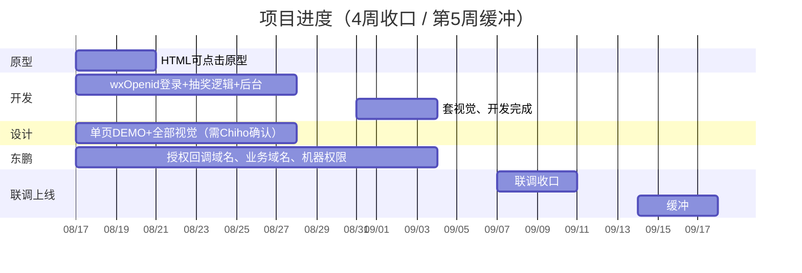

# 学产品知识拿金奖好礼 — 项目进度时间表

起算：2026-08-17（周一）  
目标收口：2026-09-11（第4周周五）  
最晚完成：2026-09-18（第5周周五，仅缓冲）

玩法：进页公众号授权 → 答 5 题 → 满 3 题抽奖 / 不满回首页 → 实物填地址。  
身份：web-view 打开 `wx-bak.xdp8.cn/get/openid/from/gzh`，回调 `wxOpenid`，H5 内换我们 token。  
部署：东鹏给新机器并提前解析域名。

---

## 里程碑

| 节点 | 日期 | 交付物 | 责任 |
|------|------|--------|------|
| M1 原型 | 8月21日 | HTML 可点击流程（假数据，不含最终视觉） | 开发 |
| M2 逻辑后台 | 8月28日 | wxOpenid 登录、5 题问答、抽奖、领奖表单接口、抽奖后台 | 开发 |
| 视觉齐套 | 不晚于 8月28日 | 单页 DEMO + 全部视觉素材 | 设计 Chiho |
| M3 开发完成 | 9月4日 | 套完视觉的 H5 + 后台 | 开发（视觉须已到） |
| 联调前置 | 不晚于 9月4日 | 授权可回调测试域名、业务域名、新机器 SSH、HTTPS | 东鹏 |
| M4 目标收口 | 9月11日 | 小程序 web-view 联调通过，可验收 | 开发 + 东鹏 |
| M5 最晚 | 9月18日 | 仅消化东鹏/视觉延误 | — |

---

## 按周

### 第1周 8.17–8.21

| 事项 | 谁 | 完成 |
|------|-----|------|
| HTML 原型（授权→5题→抽奖/回首页→填地址） | 开发 | 8月21日 |
| 建表、wxOpenid 换 token、抽奖规则骨架 | 开发 | 本周启动 |
| 确认 callbackUrl 域名、wxOpenid 能否落库 | 东鹏 | 本周给书面 |
| 单页 DEMO 时间点 | 设计 | 请 Chiho 回 |

### 第2周 8.24–8.28

| 事项 | 谁 | 完成 |
|------|-----|------|
| 抽奖逻辑收口（满3可抽、库存、幂等） | 开发 | 8月28日 |
| 抽奖后台：题库、奖品概率库存、名单导出 | 开发 | 8月28日 |
| 全部视觉素材 | 设计 | 不晚于 8月28日 |
| 题库终稿、次数 X、奖品清单和概率 | 甲方运营/市场 | 不晚于 8月28日 |

### 第3周 8.31–9.4

| 事项 | 谁 | 完成 |
|------|-----|------|
| 按视觉套 H5，开发完成 | 开发 | 9月4日 |
| 新机器、域名解析、证书、校验文件 | 东鹏 | 不晚于 9月4日 |
| 授权链接回调到活动/测试域名可用 | 东鹏 | 不晚于 9月4日 |
| 小程序业务域名：`wx-bak.xdp8.cn` + 活动域名 | 东鹏 | 不晚于 9月4日 |

### 第4周 9.7–9.11（目标完成）

| 事项 | 谁 | 完成 |
|------|-----|------|
| 部署到新机器 | 开发 | 9月8日前 |
| web-view 真授权、答题、抽奖、填地址联调 | 开发 + 东鹏 | 9月11日 |
| 验收 | 甲方 | 9月11日 |

### 第5周 9.14–9.18（仅缓冲）

视觉、授权回调、机器权限任一延误，只占用本周，不默认再加第6周。

---

## 依赖（延误只挤第5周）

1. 视觉晚于 8月28日：套 UI 顺延，目标仍 9月11日，顶到 9月18日。  
2. 题库/次数 X/奖品未定：抽奖先占位，名单以正式配置为准。  
3. 东鹏授权回调、业务域名、机器权限晚于 9月4日：联调进第5周。
