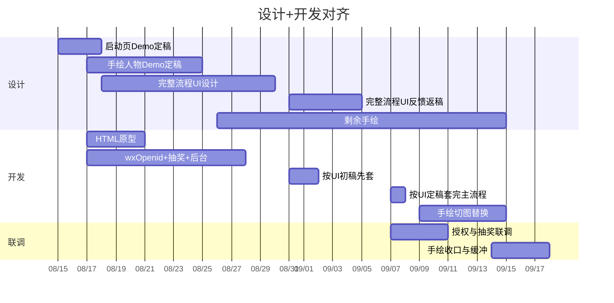

# 学产品知识拿金奖好礼 — 项目进度时间表

已对齐设计甘特（8/15–9/15）。开发不等全部手绘，主流程 UI 和剩余手绘分开收。

起算：2026-08-17  
主流程可验收：2026-09-11  
手绘切齐：2026-09-15（跟设计表）  
最晚缓冲：2026-09-18

---

## 设计节点（摘自设计表）

| 事项 | 设计 | 反馈 | 返稿定稿 |
|------|------|------|----------|
| 启动页 Demo | 8.15–8.16 | 8.17 | 8.17–8.18 |
| 手绘人物 Demo | 8.17–8.19 | 8.20–8.21 | 8.22–8.25 |
| 完整流程 UI | 8.18–8.30 | 8.31–9.2 | 9.3–9.5 |
| 剩余手绘 | 8.26–9.9 | 9.10–9.11 | 9.12–9.15 |

开发只卡两个视觉口：

- **8月18日**：启动页 Demo，给 HTML 原型用  
- **9月5日**：完整流程 UI 定稿，套主流程  
- **9月15日**：剩余手绘定稿，换切图（不挡 9月11日主流程验收）

---

## 开发里程碑

| 节点 | 日期 | 交付 | 依赖 |
|------|------|------|------|
| M1 原型 | 8月21日 | HTML 可点击流程 | 启动页 Demo（8/18）+ 会上原型 |
| M2 逻辑后台 | 8月28日 | wxOpenid 登录、问答、抽奖、后台 | 不依赖视觉 |
| M3 主流程开发完成 | 9月8日 | 按 UI 定稿套完 H5 | 完整流程 UI 9/5 定稿 |
| M4 主流程验收 | 9月11日 | web-view 授权、答题、抽奖、填地址 | 东鹏机器/域名/业务域名 |
| M5 手绘切齐 | 9月15日 | 替换剩余手绘 | 设计手绘返稿 |
| 缓冲 | 9月18日 | 只消化东鹏或返稿延误 | — |

---

## 按周

### 第1周 8.17–8.21

- 开发：HTML 原型 8/21；建表、wxOpenid 换 token、抽奖骨架  
- 设计：启动页 Demo 返稿 8/18；人物 Demo 设计中  
- 东鹏：书面确认 wxOpenid 可落库、callbackUrl 域名  

### 第2周 8.24–8.28

- 开发：抽奖逻辑 + 后台收口（8/28）  
- 设计：人物 Demo 返稿 8/25；完整流程 UI 设计进行到 8/30  
- 甲方：题库、次数 X、奖品概率尽量本周给，否则后台先占位  

### 第3周 8.31–9.4

- 开发：用 UI 初稿（8/30）先套页面，不锁像素  
- 设计：UI 反馈 8/31–9/2，返稿到 9/5  
- 东鹏：新机器、域名、证书、业务域名（`wx-bak.xdp8.cn` + 活动域名）本周给齐  

### 第4周 9.7–9.11

- 开发：9/5 定稿后 9/7–9/8 套完主流程；部署；联调授权/答题/抽奖  
- **9月11日主流程可验收**（功能 + 主 UI，手绘可仍有占位）  

### 第5周 9.14–9.18

- 设计手绘反馈返稿 9/10–9/15，开发替换切图  
- 9/15 手绘切齐；9/16–9/18 缓冲  

---

## 原则

1. 抽奖和后台不盯设计，第2周先做完。  
2. 联调不盯手绘，主 UI 定稿后即可接真授权。  
3. 9月11日验的是能玩、能抽、能填地址；9月15日验的是手绘是否换齐。
